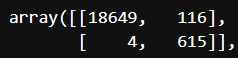

# Supervised Learning - Home Work Week 6

## Credit Risk Model Overview
This model is designed to predict risky loans within a data-set of loans using Logistic Regression. 
The specific data that the model is used to train on had the following data; loan size, interest rate, borrower income, debt to income, number of accounts, derogatory marks, total debt and loans status. Loans status was the target data that the model was trying to predict whether the loans were risky or not. 
I used value_counts() function to see if the data set was imbalanced, as it is I therefor used the RandomOverSampler module to balance the data. 
The process I went through to analyse the data was the following:    
* Split the data into training and testing sets.  
* Created a logistic regression model with the original data.   
* Displayed the balanced_accuracy, confusion matrix and classification report.   
* Create a new logistic regression model with re-sampled training data using RandomOverSampler.  
* Displayed the balanced_accuracy, confusion matrix and classification report.  
Methods used: LogisticRegression, RandomOverSampler.

## Results

Machine Learning Model 1 Logistic Regression with Original data:
  * The recall is pretty good here with 0.99 for 0 and 0.91 for 1. Recall is the ability of the module to find all positive samples. With 1 being the risky loan we can see that some risky loans are still getting through. Precision is the ability of the model to not label as positive sample when it is negative.  
  

Machine Learning Model 2 Logistic Regression with Re-sampled Training data:
  * The recall is even better with the Re-sampled model. The results were 0.99 for 0 and 0.99 for 1. As above Recall is the ability to find all positive samples. With 1 being the risky loan we can see that not many risky loans are not being picked up by the model. The '1' precision is 0.01 lower, which is ok as the recall is higher, it probably means there are more false positives which is ok. The confusion matrix actual shows this.  

## Summary

Within this credit risk model I used the Logistic Regression Model to identify risky loans. I also identified that the data was imbalanced so I used the RandomOverSampler module to balance the data. 

#### Model 1 Logistic Regression model with Original data
Using the logistic regression model worked pretty well with the imbalanced data but it didn't pick up 56 risky loans which was a little concerning. See the below confusion matrix, the model identified 563 True Positives, meaning True risky loans and 18,663 True negatives, meaning True healthy loans. The 56 is False Negatives, means False healthy loans or in other words risky loans. Therefor this is what the model needs to aim to minimise. The 102 is False positives, means False risky loans or in other words healthy loans. These errors are not so bad as it is better for the model to pick false positives then false negatives. 

* Confusion matrix (Logistric Regression Model with original data)  

#### Model 2 Logistic Regression model with Re-sampled Training data
As you can see by the confusion matrix below, Model 2 worked a lot better with minimising the False negatives, with only 4 compared to 56 above. The model also improved on the True Positives of 615 compared to 563. The False positives are higher at 116 compared to 102 above but as mentioned, it is beneficial to have more False Postives to ensure the model is capturing as many risky loans as possible. 

* Confusion matrix (Logistric Regression Model with Re-sampled data)   

As its more import to predict '1's being risky loans I recommend using model 2 using Logistic Regression model with re-sampled training data from RandomOverSampled.

By Joshua Woods 17/09/2023
